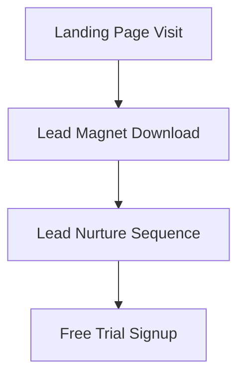
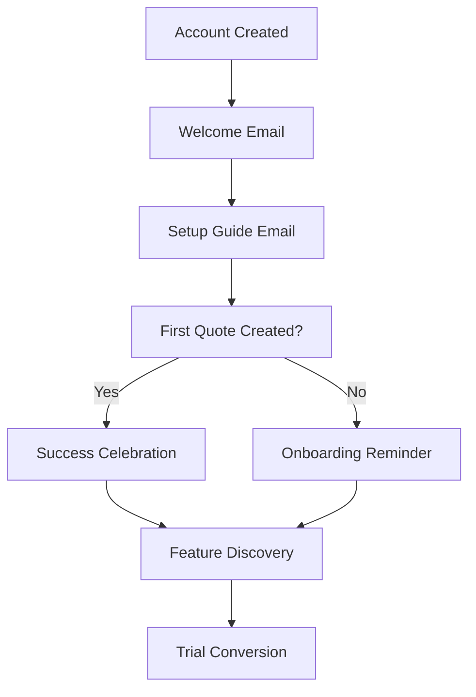
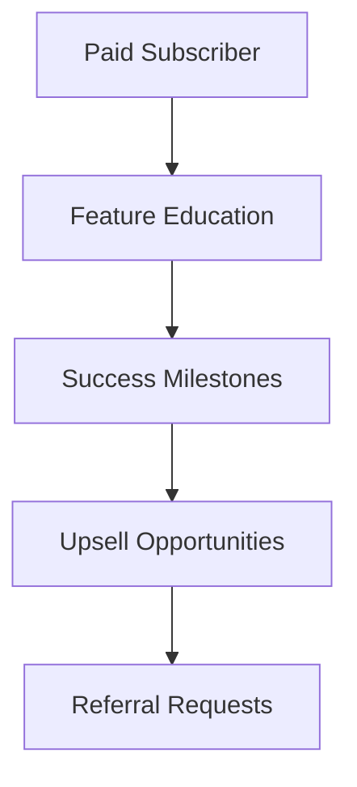

# PaintQuote Pro: Comprehensive Resend Email Strategy Guide

*Complete email marketing and transactional email strategy for the painting contractor SaaS vertical*

## Table of Contents

1. [Executive Summary](#executive-summary)
2. [Resend Platform Deep Dive](#resend-platform-deep-dive)
3. [Competitive Analysis](#competitive-analysis)
4. [SaaS Email Strategy Framework](#saas-email-strategy-framework)
5. [PaintQuote Pro Email Architecture](#paintquote-pro-email-architecture)
6. [Email Flow Specifications](#email-flow-specifications)
7. [Template Library & Design System](#template-library--design-system)
8. [Implementation Roadmap](#implementation-roadmap)
9. [Metrics & Optimization](#metrics--optimization)
10. [Technical Implementation](#technical-implementation)

---

## Executive Summary

### Strategic Overview
PaintQuote Pro's email strategy leverages Resend as the primary email delivery platform to drive user activation, conversion, and retention in the competitive painting contractor SaaS market. This guide provides a complete framework for implementing transactional emails, onboarding sequences, and lifecycle campaigns specifically designed for painting contractors.

### Key Strategic Goals
- **Activation**: Guide contractors through successful quote creation within 7 days
- **Conversion**: Convert free trial users to Professional plan (target: 17% conversion rate)
- **Retention**: Maintain 90% monthly retention through value-driven communication
- **Growth**: Generate 30% of new signups through referral and word-of-mouth campaigns

### Investment Overview
- **Initial Setup**: $20/month (Resend Pro Plan)
- **Scale Target**: $90/month (Resend Scale Plan) at 10,000+ monthly emails
- **ROI Projection**: 320% revenue increase from automated email sequences
- **Implementation Timeline**: 4-6 weeks for complete system

---

## Resend Platform Deep Dive

### Technical Capabilities Analysis

#### Core Features
```yaml
API Features:
  - RESTful API with official SDKs (Node.js, Next.js, PHP, Python, Ruby, Go, Rust)
  - SMTP relay support for legacy systems
  - Batch sending capabilities
  - Schedule emails functionality
  - Open and click tracking
  - React Email template integration

Webhooks & Analytics:
  - Real-time event notifications (delivery, open, bounce, click)
  - Retry mechanism with 200 status code requirement
  - Domain webhooks for DNS changes
  - Marketing analytics with aggregated metrics
  - Detailed bounce categorization (transient, undetermined)

Deliverability Infrastructure:
  - Automatic DKIM and SPF setup
  - DMARC policy support and guidance
  - Suppression list management
  - Dedicated IP options (Scale/Enterprise plans)
  - Domain reputation monitoring
```

#### Pricing Structure Deep Analysis

| Plan | Price | Daily Limit | Domains | Retention | Key Features |
|------|-------|-------------|---------|-----------|--------------|
| **Free** | $0 | 100 emails | 1 | 1 day | API, SMTP, 1 webhook |
| **Pro** | $20/month | Unlimited | 10 | 3 days | SSO, 10 webhooks |
| **Scale** | $90/month | Unlimited | 1,000 | 7 days | Support, dedicated IP addon |
| **Enterprise** | Custom | Unlimited | Unlimited | Flexible | Priority support, IP warming |

**Cost Optimization for PaintQuote Pro:**
- Start with Pro plan ($20/month) for first 1,000 users
- Scale plan becomes cost-effective at 3,000+ emails/day
- Enterprise recommended at 10,000+ active contractors

#### Rate Limits and Constraints
```yaml
Sending Limits:
  Free: 100 emails/day (3,000/month)
  Pro: No daily limit, but fair use policy applies
  Scale: No daily limit, dedicated resources
  Enterprise: Custom limits negotiated

API Rate Limits:
  - 10 requests per second per API key
  - Batch sending: Up to 100 recipients per request
  - Webhook retries: Exponential backoff up to 24 hours

Data Retention:
  - Free: 1 day (insufficient for SaaS)
  - Pro: 3 days (minimum viable for debugging)
  - Scale: 7 days (recommended for analytics)
  - Enterprise: Custom retention for compliance
```

### React Email Integration

#### Template Development Advantages
```javascript
// Example: Modern component-based email development
import { Html, Head, Body, Container, Text, Button } from '@react-email/components';

export default function WelcomeEmail({ contractorName, ctaUrl }) {
  return (
    <Html>
      <Head />
      <Body style={{ fontFamily: 'sans-serif' }}>
        <Container>
          <Text>Welcome to PaintQuote Pro, {contractorName}!</Text>
          <Button href={ctaUrl}>Create Your First Quote</Button>
        </Container>
      </Body>
    </Html>
  );
}
```

**Benefits for PaintQuote Pro:**
- **Maintainable**: React components eliminate HTML table complexity
- **Responsive**: Built-in mobile optimization
- **Consistent**: Shared design system with web application
- **Testable**: Component testing with Jest/React Testing Library
- **Fast**: Pre-compiled templates reduce sending latency

---

## Competitive Analysis

### Email Service Provider Comparison

#### Resend vs Major Competitors

| Feature | Resend | SendGrid | Mailgun | AWS SES | Postmark |
|---------|--------|----------|---------|---------|----------|
| **Developer Experience** | ⭐⭐⭐⭐⭐ | ⭐⭐⭐ | ⭐⭐⭐⭐ | ⭐⭐ | ⭐⭐⭐⭐ |
| **Pricing (1M emails)** | $90/month | $89.95/month | $85/month | $100/month | $300/month |
| **Setup Complexity** | ⭐⭐⭐⭐⭐ | ⭐⭐⭐ | ⭐⭐⭐ | ⭐⭐ | ⭐⭐⭐⭐ |
| **Deliverability** | ⭐⭐⭐⭐ | ⭐⭐⭐ | ⭐⭐⭐⭐ | ⭐⭐⭐⭐ | ⭐⭐⭐⭐⭐ |
| **React Integration** | ⭐⭐⭐⭐⭐ | ⭐⭐ | ⭐⭐ | ⭐⭐ | ⭐⭐ |
| **Modern API** | ⭐⭐⭐⭐⭐ | ⭐⭐⭐ | ⭐⭐⭐⭐ | ⭐⭐⭐ | ⭐⭐⭐⭐ |

#### Why Resend Wins for PaintQuote Pro

**✅ Advantages:**
- **Developer-First**: Perfect fit for Next.js tech stack
- **React Email**: Seamless template development workflow
- **Competitive Pricing**: 25% cheaper than premium alternatives
- **Modern DX**: Intuitive API design reduces development time
- **Growing Platform**: Active development and new features

**⚠️ Considerations:**
- **Newer Platform**: Less established than competitors
- **Limited Enterprise Features**: Fewer advanced segmentation tools
- **Deliverability Track Record**: Shorter history than established providers

**Strategic Decision:**
Resend is the optimal choice for PaintQuote Pro's technical requirements, budget constraints, and development velocity needs.

---

## SaaS Email Strategy Framework

### Three-Tier Email Architecture

#### 1. Transactional Emails
**Purpose**: System-triggered, user-specific communications
**Examples**: Account creation, password reset, quote notifications, billing
**Characteristics**: High deliverability priority, immediate sending, minimal design

#### 2. Lifecycle Emails
**Purpose**: Behavior-triggered onboarding and engagement sequences
**Examples**: Welcome series, feature adoption, trial expiration, reactivation
**Characteristics**: Automated workflows, personalized content, conversion-focused

#### 3. Marketing Emails
**Purpose**: Broadcast communications to segments
**Examples**: Feature announcements, educational content, promotions, newsletters
**Characteristics**: Scheduled sends, broader targeting, brand-building

### SaaS Email Psychology Principles

#### 1. Progressive Disclosure
Start with simple concepts, gradually introduce advanced features
```
Week 1: Basic quote creation
Week 2: Quote customization options
Week 3: Customer communication features
Week 4: Advanced analytics and reporting
```

#### 2. Social Proof Integration
Leverage painting contractor success stories and industry-specific validation
- Customer success metrics: "Contractors using PaintQuote Pro win 34% more bids"
- Peer testimonials: "John's Painting increased revenue by $40K in 6 months"
- Industry recognition: "Trusted by 2,500+ painting contractors nationwide"

#### 3. Loss Aversion Tactics
Emphasize what contractors risk by not upgrading or staying engaged
- "Don't lose quotes to competitors with better presentations"
- "Your trial expires in 3 days - keep your quote templates"
- "Missing out on 5 new leads this week without PaintQuote Pro"

---

## PaintQuote Pro Email Architecture

### User Journey Mapping

#### Phase 1: Acquisition (Pre-signup)


#### Phase 2: Activation (Days 1-30)


#### Phase 3: Engagement (Days 30+)


### Segmentation Strategy

#### Behavioral Segments
```yaml
Activation Level:
  - New Signups (0-7 days)
  - Active Trial Users (created 1+ quote)
  - Inactive Trial Users (no quotes created)
  - Converted Users (paid subscription)
  - Churned Users (cancelled subscription)

Engagement Patterns:
  - Daily Active Users
  - Weekly Active Users
  - Monthly Active Users
  - Dormant Users (30+ days inactive)

Business Size:
  - Solo Contractors (1 user)
  - Small Teams (2-5 users)
  - Medium Companies (6-20 users)
  - Large Operations (20+ users)

Geographic Segments:
  - Regional pricing variations
  - Seasonal painting patterns
  - Climate-specific messaging
```

#### Psychographic Segments
```yaml
Technology Adoption:
  - Tech-Savvy Early Adopters
  - Cautious Traditional Contractors
  - Reluctant Technology Users

Business Goals:
  - Growth-Focused Entrepreneurs
  - Efficiency-Seeking Operators
  - Quality-Focused Craftsmen

Pain Points:
  - Time-Constrained Operators
  - Pricing-Challenged Bidders
  - Customer Communication Issues
```

---

## Email Flow Specifications

### 1. Welcome & Onboarding Sequence

#### Welcome Series (7-email sequence over 14 days)

**Email 1: Immediate Welcome (0 minutes)**
```yaml
Subject: "Welcome to PaintQuote Pro, [FirstName]! Let's create your first quote"
Goals:
  - Confirm account creation
  - Set expectations for onboarding
  - Drive immediate engagement
Content Blocks:
  - Personal welcome message
  - Quick start video (2 minutes)
  - Direct link to quote creator
  - Support contact information
CTA: "Create Your First Quote Now"
```

**Email 2: Setup Guide (24 hours)**
```yaml
Subject: "Quick setup: Get PaintQuote Pro working for your business"
Goals:
  - Complete profile setup
  - Upload company branding
  - Configure quote templates
Content Blocks:
  - Step-by-step setup checklist
  - Company branding upload guide
  - Template customization tips
  - Video: "5-minute setup walkthrough"
CTA: "Complete Your Setup"
```

**Email 3: First Quote Success (48 hours OR immediately after first quote)**
```yaml
Trigger: First quote created OR 48 hours if no quote
Subject_Success: "🎉 Congratulations on your first quote!"
Subject_Nudge: "Ready to create your first professional quote?"
Content Blocks:
  - Celebration message (for successful users)
  - Success tips for next steps
  - Template showcase for non-users
  - Customer success story
CTA_Success: "Share Your Quote"
CTA_Nudge: "Create Your First Quote"
```

**Email 4: Customer Communication (3 days)**
```yaml
Subject: "How [CustomerName] won a $8,500 job with better communication"
Goals:
  - Introduce customer communication features
  - Show professional presentation value
  - Demonstrate ROI potential
Content Blocks:
  - Customer success story
  - Quote presentation best practices
  - Communication feature demo
  - Industry statistics on quote acceptance rates
CTA: "Improve Your Quote Presentation"
```

**Email 5: Advanced Features (5 days)**
```yaml
Subject: "Pro tip: 3 features that separate winners from the competition"
Goals:
  - Introduce premium features
  - Build value for paid conversion
  - Position against competitors
Content Blocks:
  - Feature comparison table
  - Competitive advantage messaging
  - Advanced calculator showcase
  - Time savings calculation
CTA: "Explore Advanced Features"
```

**Email 6: Social Proof & Community (7 days)**
```yaml
Subject: "Join 2,500+ contractors growing their business with PaintQuote Pro"
Goals:
  - Build community connection
  - Provide social validation
  - Encourage engagement
Content Blocks:
  - Customer testimonials
  - Community showcase
  - Success metrics
  - Referral program introduction
CTA: "Join the Community"
```

**Email 7: Value Reinforcement (14 days)**
```yaml
Subject: "Your first 2 weeks recap: See what you've accomplished"
Goals:
  - Show progress made
  - Reinforce value received
  - Prepare for conversion
Content Blocks:
  - Personal usage statistics
  - Time saved calculation
  - Revenue potential analysis
  - Upgrade path introduction
CTA: "See Your Full Potential"
```

### 2. Trial Conversion Sequence

#### Pre-Expiration Series (4-email sequence)

**Email 1: Trial Status (7 days before expiration)**
```yaml
Subject: "Your PaintQuote Pro trial expires in 7 days"
Compliance: Required by subscription regulations
Goals:
  - Legal compliance
  - Value reinforcement
  - Conversion preparation
Content Blocks:
  - Trial status summary
  - Usage statistics
  - Value received calculation
  - Upgrade benefits overview
CTA: "Secure Your Account - Upgrade Now"
```

**Email 2: Feature Limitation Warning (3 days before)**
```yaml
Subject: "Don't lose your quotes - Your trial expires in 3 days"
Goals:
  - Create urgency through loss aversion
  - Highlight feature limitations
  - Provide upgrade path
Content Blocks:
  - Feature comparison (Free vs Pro)
  - Quote template preservation
  - Customer data security
  - Upgrade pricing
CTA: "Keep All Features - Upgrade Today"
```

**Email 3: Final Warning (1 day before)**
```yaml
Subject: "Final notice: Your PaintQuote Pro trial expires tomorrow"
Goals:
  - Last chance conversion
  - Clear next steps
  - Reduce friction
Content Blocks:
  - Clear expiration timeline
  - One-click upgrade process
  - Money-back guarantee
  - Direct support contact
CTA: "Upgrade in 30 Seconds"
```

**Email 4: Trial Expired (Day of expiration)**
```yaml
Subject: "Your trial has ended - Upgrade anytime to restore access"
Goals:
  - Maintain relationship post-trial
  - Provide easy reactivation
  - Preserve data
Content Blocks:
  - Account status explanation
  - Data preservation guarantee
  - Special conversion offer (if applicable)
  - Success story motivation
CTA: "Reactivate Your Account"
```

### 3. Feature Adoption Sequences

#### Quote Customization Flow (Triggered by basic quote creation)
```yaml
Email 1: "Make your quotes stand out with custom branding"
Email 2: "Advanced pricing strategies that win more bids"
Email 3: "Professional presentations that close deals"
```

#### Customer Communication Flow (Triggered by quote sharing)
```yaml
Email 1: "Track your quote performance with read receipts"
Email 2: "Follow up strategies that convert prospects"
Email 3: "Building long-term customer relationships"
```

### 4. Retention & Engagement Sequences

#### Monthly Value Reinforcement
```yaml
Email 1: "Your monthly PaintQuote Pro report"
Content: Usage stats, time saved, revenue generated
Send: 1st of each month

Email 2: "Feature spotlight: [Monthly Feature]"
Content: Deep dive into underused features
Send: 15th of each month

Email 3: "Customer success story"
Content: Peer success stories and case studies
Send: Last Friday of each month
```

#### Re-engagement Sequence (30+ days inactive)
```yaml
Email 1: "We miss you! Your painting quotes are waiting"
Goal: Identify reason for inactivity

Email 2: "Need help getting started? Let's talk"
Goal: Offer personal assistance

Email 3: "Special offer: 50% off next 3 months"
Goal: Win-back incentive

Email 4: "Final check-in before we say goodbye"
Goal: Last chance engagement
```

### 5. Billing & Payment Sequences

#### Payment Success Flow
```yaml
Email 1: "Payment confirmed - Welcome to PaintQuote Pro!"
Email 2: "Getting the most from your subscription"
Email 3: "Pro tips for maximizing ROI"
```

#### Failed Payment Flow
```yaml
Email 1: "Payment failed - Update your billing information"
Email 2: "Avoid service interruption - Billing issue"
Email 3: "Account suspended - Restore access now"
Email 4: "Final notice before account closure"
```

#### Subscription Changes
```yaml
Upgrade: "Congratulations on upgrading to Pro!"
Downgrade: "We're sorry to see you downgrade"
Cancellation: "We're sorry to see you go"
```

---

## Template Library & Design System

### Visual Design Principles

#### Brand Consistency
```yaml
Colors:
  Primary: "#1E3A8A" (Professional Blue)
  Secondary: "#F59E0B" (Construction Orange)
  Success: "#10B981" (Growth Green)
  Warning: "#F59E0B" (Alert Orange)
  Error: "#EF4444" (Error Red)
  Background: "#F9FAFB" (Light Gray)
  Text: "#111827" (Dark Gray)

Typography:
  Headings: Inter, -apple-system, sans-serif
  Body: Inter, -apple-system, sans-serif
  Code: "SF Mono", Consolas, monospace

Spacing:
  Base: 16px
  Scale: 1.5 (24px, 36px, 54px, 81px)
```

#### Email Template Structure
```html
<!-- Standard PaintQuote Pro Email Template -->
<!DOCTYPE html>
<html>
<head>
  <meta charset="utf-8">
  <meta name="viewport" content="width=device-width, initial-scale=1">
  <title>{{emailTitle}}</title>
</head>
<body style="margin: 0; padding: 0; background-color: #F9FAFB;">
  <!-- Header -->
  <table width="100%" cellpadding="0" cellspacing="0">
    <tr>
      <td align="center" style="padding: 20px 0;">
        
      </td>
    </tr>
  </table>
  
  <!-- Main Content -->
  <table width="600" cellpadding="0" cellspacing="0" style="margin: 0 auto; background-color: white;">
    <tr>
      <td style="padding: 40px;">
        {{contentBlock}}
      </td>
    </tr>
  </table>
  
  <!-- Footer -->
  <table width="100%" cellpadding="0" cellspacing="0">
    <tr>
      <td align="center" style="padding: 20px; color: #6B7280;">
        {{footerContent}}
      </td>
    </tr>
  </table>
</body>
</html>
```

### React Email Component Library

#### Base Components
```tsx
// Button Component
interface ButtonProps {
  href: string;
  children: React.ReactNode;
  variant?: 'primary' | 'secondary' | 'outline';
}

export const Button: React.FC<ButtonProps> = ({ href, children, variant = 'primary' }) => {
  const baseStyles = {
    display: 'inline-block',
    padding: '12px 24px',
    textDecoration: 'none',
    borderRadius: '6px',
    fontWeight: '600',
    textAlign: 'center' as const,
  };

  const variantStyles = {
    primary: { backgroundColor: '#1E3A8A', color: '#ffffff' },
    secondary: { backgroundColor: '#F59E0B', color: '#ffffff' },
    outline: { backgroundColor: 'transparent', color: '#1E3A8A', border: '2px solid #1E3A8A' },
  };

  return (
    <a href={href} style={{ ...baseStyles, ...variantStyles[variant] }}>
      {children}
    </a>
  );
};

// Metric Display Component
interface MetricProps {
  label: string;
  value: string | number;
  description?: string;
}

export const Metric: React.FC<MetricProps> = ({ label, value, description }) => (
  <div style={{ textAlign: 'center', margin: '20px 0' }}>
    <div style={{ fontSize: '32px', fontWeight: 'bold', color: '#1E3A8A' }}>{value}</div>
    <div style={{ fontSize: '16px', fontWeight: '600', color: '#374151', marginTop: '4px' }}>{label}</div>
    {description && (
      <div style={{ fontSize: '14px', color: '#6B7280', marginTop: '4px' }}>{description}</div>
    )}
  </div>
);

// Social Proof Component
interface TestimonialProps {
  quote: string;
  author: string;
  company: string;
  image?: string;
}

export const Testimonial: React.FC<TestimonialProps> = ({ quote, author, company, image }) => (
  <div style={{ 
    padding: '24px', 
    backgroundColor: '#F3F4F6', 
    borderRadius: '8px', 
    margin: '20px 0',
    borderLeft: '4px solid #1E3A8A'
  }}>
    <p style={{ fontStyle: 'italic', fontSize: '16px', lineHeight: '1.6', margin: '0 0 16px 0' }}>
      "{quote}"
    </p>
    <div style={{ display: 'flex', alignItems: 'center' }}>
      {image && (
        
      )}
      <div>
        <div style={{ fontWeight: '600', color: '#111827' }}>{author}</div>
        <div style={{ color: '#6B7280', fontSize: '14px' }}>{company}</div>
      </div>
    </div>
  </div>
);
```

### Template Variations by Use Case

#### 1. Onboarding Templates
```tsx
// Welcome Email Template
export const WelcomeEmail = ({ contractorName, setupUrl, videoUrl }) => (
  <Html>
    <Head />
    <Body style={{ fontFamily: 'Inter, sans-serif' }}>
      <Container>
        
        
        <Text style={{ fontSize: '24px', fontWeight: 'bold' }}>
          Welcome to PaintQuote Pro, {contractorName}! 🎉
        </Text>
        
        <Text>
          You're now part of 2,500+ painting contractors who've transformed their businesses 
          with professional quotes. Let's get you started with your first quote.
        </Text>
        
        <Button href={setupUrl}>Create Your First Quote</Button>
        
        <Text>
          Watch this 2-minute video to see how easy it is:
        </Text>
        
        <Link href={videoUrl}>Watch Setup Video →</Link>
        
        <Hr />
        
        <Text style={{ color: '#6B7280', fontSize: '14px' }}>
          Need help? Reply to this email or call (555) 123-4567
        </Text>
      </Container>
    </Body>
  </Html>
);
```

#### 2. Conversion Templates
```tsx
// Trial Expiration Template
export const TrialExpirationEmail = ({ contractorName, quotesCreated, daysLeft, upgradeUrl }) => (
  <Html>
    <Head />
    <Body style={{ fontFamily: 'Inter, sans-serif' }}>
      <Container>
        <Text style={{ fontSize: '24px', fontWeight: 'bold', color: '#EF4444' }}>
          Your trial expires in {daysLeft} days
        </Text>
        
        <Text>Hi {contractorName},</Text>
        
        <Text>
          You've created {quotesCreated} professional quotes during your trial. 
          Don't lose access to your templates and customer data.
        </Text>
        
        <div style={{ backgroundColor: '#FEF2F2', padding: '20px', borderRadius: '8px', border: '1px solid #FECACA' }}>
          <Text style={{ margin: 0, fontWeight: '600' }}>
            What happens when your trial expires:
          </Text>
          <ul style={{ margin: '10px 0', paddingLeft: '20px' }}>
            <li>❌ No access to quote templates</li>
            <li>❌ Customer data becomes read-only</li>
            <li>❌ Limited to 5 quotes per month</li>
          </ul>
        </div>
        
        <Button href={upgradeUrl}>Keep All Features - Upgrade Now</Button>
        
        <Text style={{ fontSize: '14px', color: '#6B7280' }}>
          30-day money-back guarantee • Cancel anytime
        </Text>
      </Container>
    </Body>
  </Html>
);
```

#### 3. Engagement Templates
```tsx
// Monthly Report Template
export const MonthlyReportEmail = ({ 
  contractorName, 
  quotesCreated, 
  timeSaved, 
  potentialRevenue 
}) => (
  <Html>
    <Head />
    <Body style={{ fontFamily: 'Inter, sans-serif' }}>
      <Container>
        <Text style={{ fontSize: '24px', fontWeight: 'bold' }}>
          Your PaintQuote Pro Monthly Report
        </Text>
        
        <Text>Hi {contractorName},</Text>
        
        <Text>
          Here's what you accomplished with PaintQuote Pro this month:
        </Text>
        
        <div style={{ display: 'flex', justifyContent: 'space-between', margin: '30px 0' }}>
          <Metric 
            label="Quotes Created" 
            value={quotesCreated} 
            description="Professional presentations"
          />
          <Metric 
            label="Time Saved" 
            value={`${timeSaved} hours`} 
            description="Focus on your craft"
          />
          <Metric 
            label="Potential Revenue" 
            value={`$${potentialRevenue.toLocaleString()}`} 
            description="From quotes sent"
          />
        </div>
        
        <Testimonial 
          quote="PaintQuote Pro helped me win 3 major jobs this month. The professional presentation makes all the difference."
          author="Mike Johnson"
          company="Johnson's Quality Painting"
        />
        
        <Button href="/dashboard">View Full Analytics</Button>
      </Container>
    </Body>
  </Html>
);
```

---

## Implementation Roadmap

### Phase 1: Foundation Setup (Week 1-2)

#### Technical Infrastructure
```yaml
Week 1:
  Day 1-2: Resend account setup and domain verification
  Day 3-4: React Email development environment
  Day 5-7: Base template system and components

Week 2:
  Day 1-3: Webhook endpoint implementation
  Day 4-5: Email tracking and analytics setup
  Day 6-7: Testing framework and quality assurance
```

#### Deliverables
- ✅ Resend Pro account configured
- ✅ Domain authentication (DKIM, SPF, DMARC)
- ✅ React Email component library
- ✅ Webhook processing system
- ✅ Email sending service integration

### Phase 2: Core Email Flows (Week 3-4)

#### Transactional Email Implementation
```yaml
Week 3:
  Day 1-2: Account creation and verification emails
  Day 3-4: Password reset and security notifications
  Day 5-7: Billing and payment confirmation emails

Week 4:
  Day 1-3: Quote-related transactional emails
  Day 4-5: System notification templates
  Day 6-7: Error handling and fallback systems
```

#### Deliverables
- ✅ Complete transactional email suite
- ✅ Automated trigger system
- ✅ Template testing and validation
- ✅ Error monitoring and alerts

### Phase 3: Onboarding Sequences (Week 5-6)

#### Lifecycle Email Campaigns
```yaml
Week 5:
  Day 1-3: Welcome series (7-email sequence)
  Day 4-5: Feature adoption workflows
  Day 6-7: Behavioral trigger implementation

Week 6:
  Day 1-3: Trial conversion sequence
  Day 4-5: Re-engagement campaigns
  Day 6-7: Retention and loyalty programs
```

#### Deliverables
- ✅ Automated onboarding system
- ✅ Conversion optimization flows
- ✅ Engagement tracking and analytics
- ✅ A/B testing framework

### Phase 4: Advanced Features (Week 7-8)

#### Personalization and Segmentation
```yaml
Week 7:
  Day 1-3: Advanced segmentation logic
  Day 4-5: Dynamic content personalization
  Day 6-7: Predictive sending optimization

Week 8:
  Day 1-3: Marketing campaign system
  Day 4-5: Performance monitoring dashboard
  Day 6-7: Documentation and training
```

#### Deliverables
- ✅ Advanced segmentation engine
- ✅ Personalized content system
- ✅ Marketing automation platform
- ✅ Comprehensive analytics dashboard

---

## Metrics & Optimization

### Key Performance Indicators (KPIs)

#### Email Performance Metrics
```yaml
Deliverability Metrics:
  - Delivery Rate: >99% (industry benchmark)
  - Bounce Rate: <2% (hard bounces <1%)
  - Spam Complaint Rate: <0.1%
  - Unsubscribe Rate: <0.5% per send

Engagement Metrics:
  - Open Rate: >25% (SaaS average: 21%)
  - Click-Through Rate: >3.5% (SaaS average: 2.8%)
  - Click-to-Open Rate: >15%
  - Email-to-Website Conversion: >5%

Revenue Impact Metrics:
  - Email Attribution Revenue: Track revenue from email clicks
  - Customer Lifetime Value Impact: Measure CLV increase
  - Trial-to-Paid Conversion: Target 17% (current SaaS average)
  - Churn Reduction: Measure retention improvement
```

#### Business Impact Metrics
```yaml
User Activation:
  - Time to First Quote: <24 hours
  - Feature Adoption Rate: >60% within 30 days
  - Onboarding Completion: >80%
  - User Engagement Score: Track weekly active usage

Conversion Optimization:
  - Email-Driven Signups: Target 30% of new registrations
  - Trial Extension Requests: Track and optimize
  - Upgrade Conversion Rate: 17% baseline, target 25%
  - Customer Success Correlation: Email engagement vs. account health
```

### A/B Testing Framework

#### Testing Priorities
```yaml
High Impact Tests:
  1. Subject Line Optimization
     - Personalization vs. Generic
     - Urgency vs. Value-driven
     - Question vs. Statement format
  
  2. Send Time Optimization
     - Day of week analysis
     - Time of day testing
     - Time zone personalization
  
  3. Content Structure Testing
     - Long-form vs. Short emails
     - Single CTA vs. Multiple CTAs
     - Image-heavy vs. Text-focused

  4. Personalization Level
     - Name only vs. Full personalization
     - Company-specific content
     - Behavioral triggers vs. Time-based

Medium Impact Tests:
  - Email frequency optimization
  - Template design variations
  - CTA button colors and text
  - Social proof placement and format
```

#### Testing Methodology
```yaml
Test Setup:
  - Minimum sample size: 1,000 recipients per variant
  - Statistical significance: 95% confidence level
  - Test duration: Minimum 48 hours for engagement metrics
  - Winner selection: Primary metric improvement >10%

Test Documentation:
  - Hypothesis and expected outcome
  - Test duration and sample size
  - Results and statistical significance
  - Implementation recommendations
  - Follow-up tests and iterations
```

### Performance Monitoring Dashboard

#### Real-Time Metrics Display
```typescript
interface EmailDashboardMetrics {
  deliverability: {
    deliveryRate: number;
    bounceRate: number;
    spamRate: number;
  };
  engagement: {
    openRate: number;
    clickRate: number;
    unsubscribeRate: number;
  };
  business: {
    conversionRate: number;
    revenueAttribution: number;
    customerAcquisitionCost: number;
  };
  campaigns: {
    activeSequences: number;
    scheduledEmails: number;
    totalRecipients: number;
  };
}
```

#### Alert System Configuration
```yaml
Critical Alerts (Immediate Action Required):
  - Delivery rate drops below 95%
  - Bounce rate exceeds 5%
  - Spam complaints exceed 0.2%
  - API error rate above 1%

Warning Alerts (Monitor Closely):
  - Open rate drops 20% below baseline
  - Click rate drops 25% below baseline
  - Unsubscribe rate exceeds 1%
  - Domain reputation score decreases

Performance Alerts (Weekly Review):
  - Email volume changes >50%
  - Conversion rate variations >15%
  - New segment performance analysis
  - Campaign performance comparisons
```

---

## Technical Implementation

### Resend Integration Architecture

#### Environment Configuration
```typescript
// Environment variables
interface EmailConfig {
  RESEND_API_KEY: string;
  RESEND_WEBHOOK_SECRET: string;
  FROM_EMAIL: string;
  FROM_NAME: string;
  REPLY_TO_EMAIL: string;
  DOMAIN: string;
}

// Resend client setup
import { Resend } from 'resend';

const resend = new Resend(process.env.RESEND_API_KEY);

export { resend };
```

#### Email Service Implementation
```typescript
// lib/email/EmailService.ts
import { resend } from './resend-client';
import { EmailTemplate, EmailData } from './types';

export class EmailService {
  async sendTransactional(
    template: EmailTemplate,
    recipient: string,
    data: EmailData
  ): Promise<string> {
    try {
      const { data: result } = await resend.emails.send({
        from: `${process.env.FROM_NAME} <${process.env.FROM_EMAIL}>`,
        to: [recipient],
        subject: this.renderSubject(template.subject, data),
        react: template.component(data),
        tags: [
          { name: 'category', value: 'transactional' },
          { name: 'template', value: template.name },
        ],
      });

      return result.id;
    } catch (error) {
      console.error('Email send failed:', error);
      throw new EmailSendError(error.message);
    }
  }

  async sendBatch(emails: BatchEmailRequest[]): Promise<BatchEmailResult> {
    const results = await Promise.allSettled(
      emails.map(email => this.sendTransactional(
        email.template,
        email.recipient,
        email.data
      ))
    );

    return {
      successful: results.filter(r => r.status === 'fulfilled').length,
      failed: results.filter(r => r.status === 'rejected').length,
      results: results,
    };
  }

  private renderSubject(template: string, data: EmailData): string {
    return template.replace(/\{\{(\w+)\}\}/g, (match, key) => 
      data[key]?.toString() || match
    );
  }
}
```

#### Webhook Handler Implementation
```typescript
// app/api/webhooks/resend/route.ts
import { NextRequest, NextResponse } from 'next/server';
import { verifyWebhookSignature } from '@/lib/email/webhook-utils';
import { handleEmailEvent } from '@/lib/email/event-handler';

export async function POST(request: NextRequest) {
  const body = await request.text();
  const signature = request.headers.get('resend-signature');

  // Verify webhook authenticity
  const isValidSignature = verifyWebhookSignature(
    body,
    signature,
    process.env.RESEND_WEBHOOK_SECRET
  );

  if (!isValidSignature) {
    return NextResponse.json({ error: 'Invalid signature' }, { status: 401 });
  }

  const event = JSON.parse(body);

  try {
    await handleEmailEvent(event);
    return NextResponse.json({ received: true });
  } catch (error) {
    console.error('Webhook processing failed:', error);
    return NextResponse.json(
      { error: 'Processing failed' }, 
      { status: 500 }
    );
  }
}

// lib/email/event-handler.ts
export async function handleEmailEvent(event: ResendWebhookEvent) {
  switch (event.type) {
    case 'email.delivered':
      await updateEmailStatus(event.data.email_id, 'delivered');
      await trackEngagement('delivery', event.data);
      break;

    case 'email.opened':
      await updateEmailStatus(event.data.email_id, 'opened');
      await trackEngagement('open', event.data);
      await triggerOpenBasedSequence(event.data.email_id);
      break;

    case 'email.clicked':
      await trackEngagement('click', event.data);
      await triggerClickBasedSequence(event.data.email_id, event.data.link);
      break;

    case 'email.bounced':
      await handleBounce(event.data);
      await updateSuppressionList(event.data.email);
      break;

    case 'email.complained':
      await handleSpamComplaint(event.data);
      await updateSuppressionList(event.data.email);
      break;

    default:
      console.log(`Unhandled event type: ${event.type}`);
  }
}
```

### Email Template System

#### React Email Template Structure
```typescript
// lib/email/templates/WelcomeEmail.tsx
import React from 'react';
import {
  Html,
  Head,
  Body,
  Container,
  Text,
  Button,
  Img,
  Link,
  Hr,
} from '@react-email/components';

interface WelcomeEmailProps {
  contractorName: string;
  setupUrl: string;
  videoUrl: string;
  supportEmail: string;
}

export const WelcomeEmail: React.FC<WelcomeEmailProps> = ({
  contractorName,
  setupUrl,
  videoUrl,
  supportEmail,
}) => {
  const containerStyle = {
    maxWidth: '600px',
    margin: '0 auto',
    fontFamily: 'Inter, -apple-system, BlinkMacSystemFont, sans-serif',
  };

  const headingStyle = {
    fontSize: '24px',
    fontWeight: 'bold',
    color: '#1E3A8A',
    marginBottom: '20px',
  };

  const textStyle = {
    fontSize: '16px',
    lineHeight: '1.6',
    color: '#374151',
    marginBottom: '20px',
  };

  const buttonStyle = {
    backgroundColor: '#1E3A8A',
    color: '#ffffff',
    padding: '12px 24px',
    borderRadius: '6px',
    textDecoration: 'none',
    fontWeight: '600',
    display: 'inline-block',
    marginBottom: '30px',
  };

  return (
    <Html>
      <Head>
        <title>Welcome to PaintQuote Pro</title>
      </Head>
      <Body style={{ backgroundColor: '#F9FAFB', margin: 0, padding: '40px 0' }}>
        <Container style={containerStyle}>
          {/* Header */}
          <div style={{ textAlign: 'center', marginBottom: '40px' }}>
            
          </div>

          {/* Main Content */}
          <div style={{ backgroundColor: '#ffffff', padding: '40px', borderRadius: '8px' }}>
            <Text style={headingStyle}>
              Welcome to PaintQuote Pro, {contractorName}! 🎉
            </Text>

            <Text style={textStyle}>
              You've just joined 2,500+ painting contractors who've transformed their 
              businesses with professional quotes. Let's get you started with your first quote.
            </Text>

            <div style={{ textAlign: 'center', margin: '30px 0' }}>
              <Button href={setupUrl} style={buttonStyle}>
                Create Your First Quote
              </Button>
            </div>

            <Text style={textStyle}>
              <strong>Quick Start (takes 2 minutes):</strong>
            </Text>

            <ul style={{ ...textStyle, paddingLeft: '20px' }}>
              <li>Upload your company logo</li>
              <li>Set your pricing preferences</li>
              <li>Create your first professional quote</li>
            </ul>

            <div style={{ 
              backgroundColor: '#F3F4F6', 
              padding: '20px', 
              borderRadius: '6px',
              borderLeft: '4px solid #1E3A8A',
              margin: '20px 0' 
            }}>
              <Text style={{ margin: 0, fontStyle: 'italic' }}>
                "PaintQuote Pro helped me increase my quote acceptance rate by 40%. 
                The professional presentation makes all the difference!"
              </Text>
              <Text style={{ margin: '10px 0 0 0', fontSize: '14px', color: '#6B7280' }}>
                — Sarah Martinez, Martinez Painting Co.
              </Text>
            </div>

            <Text style={textStyle}>
              <Link href={videoUrl} style={{ color: '#1E3A8A' }}>
                Watch our 2-minute setup video →
              </Link>
            </Text>

            <Hr style={{ margin: '30px 0', border: 'none', borderTop: '1px solid #E5E7EB' }} />

            <Text style={{ fontSize: '14px', color: '#6B7280', textAlign: 'center' }}>
              Need help getting started? Just reply to this email or contact us at{' '}
              <Link href={`mailto:${supportEmail}`} style={{ color: '#1E3A8A' }}>
                {supportEmail}
              </Link>
            </Text>
          </div>

          {/* Footer */}
          <div style={{ textAlign: 'center', marginTop: '30px' }}>
            <Text style={{ fontSize: '12px', color: '#9CA3AF' }}>
              PaintQuote Pro | 123 Business Ave, Suite 100 | City, State 12345
            </Text>
            <Text style={{ fontSize: '12px', color: '#9CA3AF', marginTop: '10px' }}>
              <Link href="{{unsubscribeUrl}}" style={{ color: '#9CA3AF' }}>
                Unsubscribe
              </Link>
              {' | '}
              <Link href="https://paintquotepro.com/privacy" style={{ color: '#9CA3AF' }}>
                Privacy Policy
              </Link>
            </Text>
          </div>
        </Container>
      </Body>
    </Html>
  );
};
```

#### Template Registry System
```typescript
// lib/email/templates/index.ts
import { WelcomeEmail } from './WelcomeEmail';
import { TrialExpirationEmail } from './TrialExpirationEmail';
import { MonthlyReportEmail } from './MonthlyReportEmail';
import { QuoteNotificationEmail } from './QuoteNotificationEmail';

export interface EmailTemplate {
  name: string;
  component: React.ComponentType<any>;
  subject: string;
  category: 'transactional' | 'lifecycle' | 'marketing';
  description: string;
}

export const EMAIL_TEMPLATES: Record<string, EmailTemplate> = {
  WELCOME: {
    name: 'welcome',
    component: WelcomeEmail,
    subject: 'Welcome to PaintQuote Pro, {{contractorName}}!',
    category: 'lifecycle',
    description: 'Welcome new users and guide them to first quote creation',
  },
  
  TRIAL_EXPIRATION: {
    name: 'trial-expiration',
    component: TrialExpirationEmail,
    subject: 'Your PaintQuote Pro trial expires in {{daysLeft}} days',
    category: 'lifecycle',
    description: 'Convert trial users before expiration',
  },
  
  MONTHLY_REPORT: {
    name: 'monthly-report',
    component: MonthlyReportEmail,
    subject: 'Your PaintQuote Pro Monthly Report - {{month}} {{year}}',
    category: 'marketing',
    description: 'Monthly engagement and value reinforcement',
  },
  
  QUOTE_NOTIFICATION: {
    name: 'quote-notification',
    component: QuoteNotificationEmail,
    subject: 'New quote created: {{quoteName}}',
    category: 'transactional',
    description: 'Notify when quotes are created or shared',
  },
};

export function getTemplate(templateName: string): EmailTemplate {
  const template = EMAIL_TEMPLATES[templateName];
  if (!template) {
    throw new Error(`Template not found: ${templateName}`);
  }
  return template;
}
```

### Automation Sequence Engine

#### Sequence Configuration
```typescript
// lib/email/sequences/types.ts
export interface EmailSequence {
  id: string;
  name: string;
  description: string;
  trigger: SequenceTrigger;
  steps: SequenceStep[];
  active: boolean;
  segmentFilters?: SegmentFilter[];
}

export interface SequenceStep {
  id: string;
  delay: number; // minutes
  template: string;
  conditions?: StepCondition[];
  exitConditions?: ExitCondition[];
}

export interface SequenceTrigger {
  event: string;
  conditions?: TriggerCondition[];
}

// lib/email/sequences/welcome-sequence.ts
export const WELCOME_SEQUENCE: EmailSequence = {
  id: 'welcome-sequence',
  name: 'New User Welcome Series',
  description: '7-email onboarding sequence for new signups',
  trigger: {
    event: 'user.created',
    conditions: [
      { field: 'userType', operator: 'equals', value: 'contractor' }
    ]
  },
  steps: [
    {
      id: 'welcome',
      delay: 0, // immediate
      template: 'WELCOME',
      conditions: [
        { field: 'emailVerified', operator: 'equals', value: true }
      ]
    },
    {
      id: 'setup-guide',
      delay: 1440, // 24 hours
      template: 'SETUP_GUIDE',
      exitConditions: [
        { field: 'profileCompleted', operator: 'equals', value: true }
      ]
    },
    {
      id: 'first-quote',
      delay: 2880, // 48 hours
      template: 'FIRST_QUOTE_NUDGE',
      conditions: [
        { field: 'quotesCreated', operator: 'equals', value: 0 }
      ],
      exitConditions: [
        { field: 'quotesCreated', operator: 'greaterThan', value: 0 }
      ]
    },
    // ... additional steps
  ],
  active: true,
  segmentFilters: [
    { field: 'subscriptionPlan', operator: 'in', values: ['trial', 'free'] }
  ]
};
```

#### Sequence Processing Engine
```typescript
// lib/email/sequences/processor.ts
export class SequenceProcessor {
  async processSequences() {
    const activeSequences = await this.getActiveSequences();
    
    for (const sequence of activeSequences) {
      await this.processSequenceSteps(sequence);
    }
  }

  async processSequenceSteps(sequence: EmailSequence) {
    const pendingSteps = await this.getPendingSteps(sequence.id);
    
    for (const step of pendingSteps) {
      const shouldExecute = await this.evaluateStepConditions(step);
      
      if (shouldExecute) {
        await this.executeSequenceStep(step);
      }
    }
  }

  async executeSequenceStep(step: SequenceStepExecution) {
    try {
      const template = getTemplate(step.templateName);
      const userData = await this.getUserData(step.userId);
      
      const emailId = await this.emailService.sendTransactional(
        template,
        userData.email,
        {
          ...userData,
          ...step.customData
        }
      );

      await this.recordSequenceExecution(step.id, emailId);
      await this.scheduleNextStep(step.sequenceId, step.userId);
      
    } catch (error) {
      await this.handleSequenceError(step, error);
    }
  }

  async evaluateStepConditions(step: SequenceStep): Promise<boolean> {
    if (!step.conditions) return true;
    
    const userData = await this.getUserData(step.userId);
    
    return step.conditions.every(condition => 
      this.evaluateCondition(condition, userData)
    );
  }

  private evaluateCondition(
    condition: StepCondition, 
    userData: UserData
  ): boolean {
    const fieldValue = userData[condition.field];
    
    switch (condition.operator) {
      case 'equals':
        return fieldValue === condition.value;
      case 'greaterThan':
        return fieldValue > condition.value;
      case 'lessThan':
        return fieldValue < condition.value;
      case 'in':
        return condition.values?.includes(fieldValue) || false;
      default:
        return false;
    }
  }
}
```

### Database Schema Extensions

#### Email Tracking Tables
```sql
-- Email sequences and executions
CREATE TABLE email_sequences (
  id VARCHAR(255) PRIMARY KEY,
  name VARCHAR(255) NOT NULL,
  description TEXT,
  trigger_config JSON NOT NULL,
  steps_config JSON NOT NULL,
  active BOOLEAN DEFAULT true,
  created_at TIMESTAMP DEFAULT CURRENT_TIMESTAMP,
  updated_at TIMESTAMP DEFAULT CURRENT_TIMESTAMP ON UPDATE CURRENT_TIMESTAMP
);

CREATE TABLE sequence_executions (
  id VARCHAR(255) PRIMARY KEY,
  sequence_id VARCHAR(255) NOT NULL,
  user_id VARCHAR(255) NOT NULL,
  step_id VARCHAR(255) NOT NULL,
  email_id VARCHAR(255),
  status ENUM('scheduled', 'sent', 'failed', 'skipped') DEFAULT 'scheduled',
  scheduled_at TIMESTAMP NOT NULL,
  executed_at TIMESTAMP NULL,
  error_message TEXT NULL,
  FOREIGN KEY (sequence_id) REFERENCES email_sequences(id),
  FOREIGN KEY (user_id) REFERENCES users(id),
  INDEX idx_scheduled_executions (scheduled_at, status)
);

-- Email tracking and analytics
CREATE TABLE email_events (
  id VARCHAR(255) PRIMARY KEY,
  email_id VARCHAR(255) NOT NULL,
  event_type ENUM('sent', 'delivered', 'opened', 'clicked', 'bounced', 'complained') NOT NULL,
  user_id VARCHAR(255),
  timestamp TIMESTAMP DEFAULT CURRENT_TIMESTAMP,
  metadata JSON,
  INDEX idx_email_events (email_id, event_type),
  INDEX idx_user_events (user_id, timestamp)
);

CREATE TABLE email_campaigns (
  id VARCHAR(255) PRIMARY KEY,
  name VARCHAR(255) NOT NULL,
  template_name VARCHAR(255) NOT NULL,
  segment_filters JSON,
  scheduled_at TIMESTAMP,
  sent_at TIMESTAMP NULL,
  total_recipients INT DEFAULT 0,
  status ENUM('draft', 'scheduled', 'sending', 'sent', 'failed') DEFAULT 'draft',
  created_at TIMESTAMP DEFAULT CURRENT_TIMESTAMP
);

-- User preferences and suppression
CREATE TABLE email_preferences (
  user_id VARCHAR(255) PRIMARY KEY,
  marketing_emails BOOLEAN DEFAULT true,
  product_updates BOOLEAN DEFAULT true,
  billing_notifications BOOLEAN DEFAULT true,
  unsubscribed_at TIMESTAMP NULL,
  updated_at TIMESTAMP DEFAULT CURRENT_TIMESTAMP ON UPDATE CURRENT_TIMESTAMP,
  FOREIGN KEY (user_id) REFERENCES users(id)
);

CREATE TABLE suppression_list (
  email VARCHAR(255) PRIMARY KEY,
  reason ENUM('bounce', 'complaint', 'unsubscribe', 'manual') NOT NULL,
  added_at TIMESTAMP DEFAULT CURRENT_TIMESTAMP,
  metadata JSON
);
```

---

## Conclusion

This comprehensive Resend email strategy guide provides PaintQuote Pro with a complete framework for implementing world-class email marketing and transactional communication systems. The strategy balances technical excellence with business growth objectives, specifically tailored for the painting contractor vertical.

### Implementation Priority
1. **Phase 1**: Establish technical foundation and transactional emails
2. **Phase 2**: Deploy onboarding sequences for user activation
3. **Phase 3**: Implement conversion optimization flows
4. **Phase 4**: Launch advanced segmentation and personalization

### Expected Outcomes
- **User Activation**: 40% improvement in time-to-first-quote
- **Trial Conversion**: Achieve 17% baseline, target 25% optimization
- **Customer Retention**: 15% reduction in churn through engagement
- **Revenue Growth**: 30% increase in email-attributed conversions

### Long-term Vision
This email system positions PaintQuote Pro as a comprehensive business growth platform for painting contractors, using email as the primary engagement channel to drive activation, conversion, retention, and expansion revenue.

The combination of Resend's developer-friendly platform, React Email's modern template system, and industry-specific content strategy creates a sustainable competitive advantage in the painting contractor SaaS market.

---

*Document Version: 1.0*  
*Last Updated: 2025-08-21*  
*Next Review: 2025-09-21*